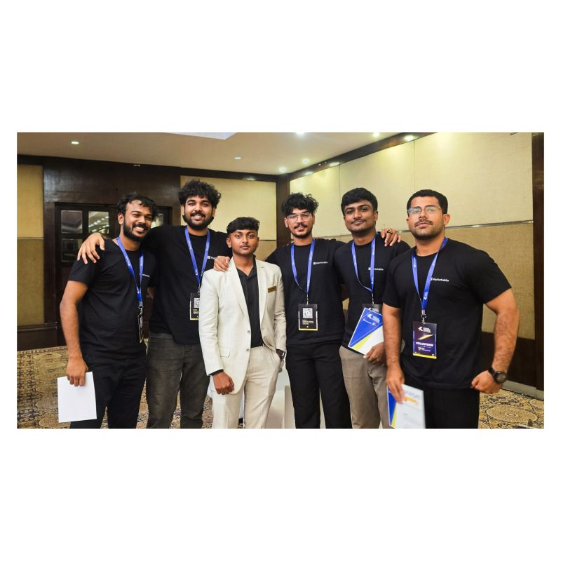

Date: July 2026
Topic: events & building
Title: The bottle flip was not what I expected to remember
Link: https://lnkd.in/p/gHExv4RB

Out of everything that happened at the Kerala Traders Carnival, the bottle flip is somehow the first thing that comes to mind.

Somewhere between a volunteer game, an unexpected stage talk, and someone turning a simple question into an opportunity, I came back thinking about something completely different.

Maybe people who build things don't always know exactly what they're doing either.

Maybe they just start :)

