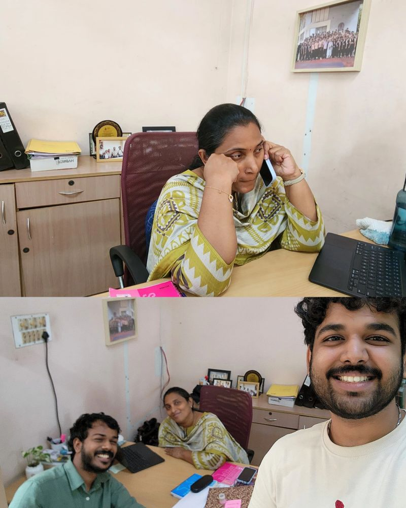

Date: July 10, 2026
Topic: campus notes
Title: Visiting college after it stopped being routine
Link: https://lnkd.in/p/gmX3uVub
---

A few months ago, going to college every morning was just routine.

This week, I "visited" my college.

Funny how quickly that happens.

I had actually gone to collect my TC and conduct certificate.

Forgot my ID card.

So I came back with neither :p

[Alex](https://www.linkedin.com/feed/update/urn:li:activity:7481196856060850178/#) and I thought we'd spend around 30 minutes meeting a few teachers before heading back.

We left almost 3 hours later.

The campus looked exactly the same.

The cabins were the same.

The people were the same.

But somehow, it all felt different.

Maybe because we weren't the ones in uniform anymore.

Maybe because the conversations had changed.

Back then, it would've been attendance, projects, internals and placements.

This time, we were just catching up.

Somewhere during our conversation, Jisha miss mentioned how her cabin used to always be full when we were around.

Someone would always be there.

With a doubt, a project issue, placement stress... or sometimes for absolutely no reason.

Maybe we stressed our teachers out quite a bit back then :')

But hearing that made me realize something I had never really thought about.

We have so many memories of our teachers and college.

Maybe they have memories of us too.

Another unexpectedly nice moment was hearing:

"LinkedIn il okke kaanaarind."

And then immediately:

"Adutha post college visit pati anoo?" :p

I don't know why, but that felt nice.

Maybe because it made me realize that these little things we've been doing don't always go unnoticed.

And somewhere in between all those conversations, for a few hours, it just felt normal again :)

I went there to collect a few documents.

Came back with neither.

But somehow, I came back thinking about how strange it was that a place I used to go to every day had somehow become a place I now "visit" :)