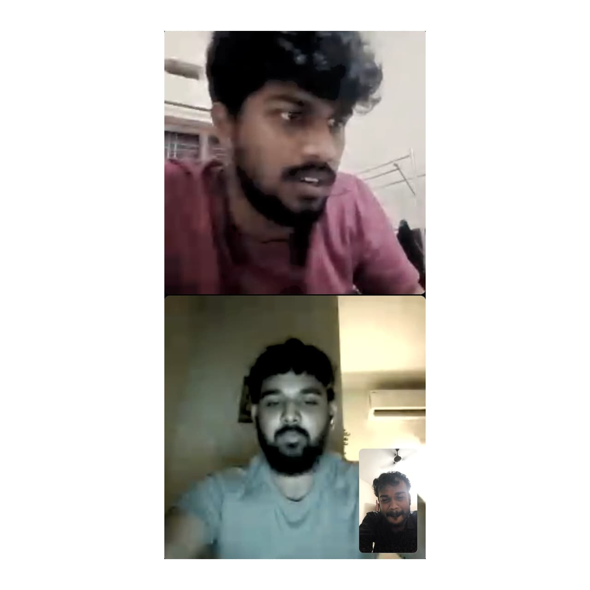

Date: June 2026
Topic: building & learning
Title: Revisiting MediQ
Link: https://lnkd.in/p/gFR_hmKK

My college mini-project always felt a little incomplete to me.

So a few of us got on a call to revisit it.

Funny thing is, we spent hours discussing edge cases and ideas without writing a single line of code.

Somehow, it already felt like progress.

Maybe good software starts with conversations before code :)

